# Identificación de proteínas humanas estructuralmente similares a la proteína quimiosensorial SlCSP8 de *Spodoptera litura*

**Autoras**

- Josefina Viviana Pérez Gamberale
- María Florencia Sironi Melffi
- Nazarena Belén Derecho Castiñeiras

**Materia:** Diseño de Fármacos

**Docente:** Ana Vélez Rueda

---

# Introducción

La resistencia a insecticidas representa uno de los principales desafíos para el control de plagas agrícolas, ya que reduce progresivamente la eficacia de los tratamientos y genera importantes pérdidas económicas.

Como consecuencia, existe un creciente interés en el desarrollo de compuestos naturales con actividad insecticida que presenten mecanismos de acción alternativos y una mayor selectividad hacia los organismos blanco. Sin embargo, además de evaluar su eficacia, resulta fundamental estudiar la posibilidad de que estos compuestos interactúen con proteínas presentes en organismos no objetivo, incluyendo proteínas humanas.

Entre las plagas de mayor importancia agrícola se encuentra *Spodoptera litura*, un lepidóptero polífago ampliamente distribuido que afecta numerosos cultivos de interés económico.

El reconocimiento de señales químicas desempeña un papel esencial en procesos como la búsqueda de alimento, la selección del hospedador y la oviposición. Estas funciones dependen de las proteínas quimiosensoriales (**Chemosensory Proteins, CSPs**), una familia de proteínas solubles encargadas de reconocer y transportar compuestos químicos hasta los receptores olfativos.

En este contexto, Zhang *et al.* identificaron a **SlCSP8** como una proteína quimiosensorial involucrada en el reconocimiento de la **rhodojaponina III**, un diterpenoide natural aislado de especies del género *Rhododendron* con actividad insecticida.

Mediante estudios de expresión génica y ensayos de afinidad, los autores demostraron que **SlCSP8** presenta una elevada capacidad de unión a este compuesto, sugiriendo que dicha interacción desempeña un papel importante en la respuesta química de *Spodoptera litura* frente a este insecticida.

Posteriormente, Jia *et al.* resolvieron la estructura cristalográfica de **SlCSP8** en complejo con **rhodojaponina III**, permitiendo caracterizar el sitio de unión responsable del reconocimiento molecular.

Este trabajo proporcionó información detallada sobre las características estructurales de la cavidad de unión y los residuos involucrados en la interacción proteína-ligando, constituyendo una base adecuada para estudios de bioinformática estructural orientados a la búsqueda de proteínas con arquitecturas tridimensionales semejantes.

Aunque las proteínas humanas no presenten necesariamente una elevada similitud de secuencia con **SlCSP8**, algunas pueden compartir un plegamiento tridimensional (*fold*) y cavidades de unión con propiedades fisicoquímicas semejantes.

Esta similitud estructural plantea la posibilidad de que determinados insecticidas naturales, además de interactuar con proteínas del insecto, puedan presentar afinidad por proteínas humanas estructuralmente relacionadas.

Si bien una afinidad predicha mediante herramientas computacionales no implica necesariamente un efecto tóxico, sí representa un indicio de una posible interacción molecular que podría alterar la función normal de una proteína y que, por lo tanto, merece ser considerada durante las etapas tempranas de evaluación de estos compuestos.

En este sentido, las herramientas de bioinformática estructural permiten explorar de manera preliminar posibles blancos fuera del organismo objetivo, aportando información útil para el análisis de la selectividad y la seguridad de potenciales insecticidas.

Con base en estos antecedentes, el presente trabajo tomó la estructura cristalográfica de **SlCSP8** como proteína de referencia para desarrollar un *pipeline* de análisis estructural.

Inicialmente, se identificaron proteínas humanas con similitud tridimensional mediante herramientas de alineamiento estructural.

Posteriormente, se analizaron las cavidades de unión de los candidatos obtenidos para seleccionar aquellos con características compatibles con el sitio de unión de **SlCSP8**.

Finalmente, se evaluó computacionalmente la interacción entre la proteína humana seleccionada y una biblioteca de insecticidas naturales mediante *docking* molecular, con el objetivo de explorar la afinidad potencial de estos compuestos por proteínas humanas estructuralmente relacionadas y generar hipótesis sobre posibles interacciones fuera del organismo objetivo.

---

# Objetivo

Evaluar, mediante un *pipeline* de bioinformática estructural, el potencial de interacción entre compuestos naturales con actividad insecticida y proteínas humanas estructuralmente similares a **SlCSP8**, utilizando la **rhodojaponina III** como compuesto de referencia para el análisis.

## Pipeline general del estudio

Con el objetivo de identificar proteínas humanas estructuralmente similares a SlCSP8 y evaluar su posible interacción con insecticidas naturales, se desarrolló el pipeline de bioinformática estructural mostrado en la Figura 1.

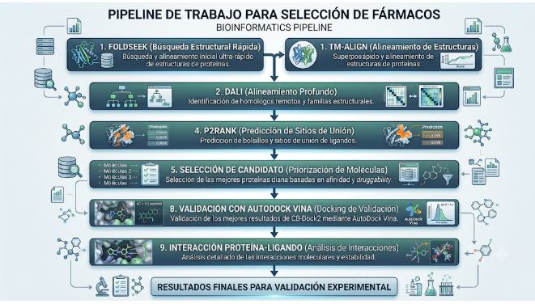

**Figura 1.** Pipeline general de bioinformática estructural utilizado en este estudio. El flujo de trabajo integra herramientas de alineamiento estructural (Foldseek, TM-align y DALI), predicción de cavidades (P2Rank), selección del candidato estructural, preparación de ligandos, docking molecular mediante CB-Dock2 y AutoDock Vina, y análisis de las interacciones proteína–ligando mediante PLIP.

## 3. Materiales y métodos

### 3.1 Proteína de referencia

Para el desarrollo del trabajo se utilizó como proteína de referencia la estructura cristalográfica de **SlCSP8**, una proteína quimiosensorial de *Spodoptera litura*. La estructura corresponde al **PDB ID: 7E8L**, cadena A, y fue obtenida del **Protein Data Bank (PDB)**.

Esta proteína fue seleccionada debido a su afinidad reportada por la **rhodojaponina III**, compuesto natural con actividad insecticida utilizado como ligando de referencia.

La estructura **7E8L** fue resuelta mediante cristalografía de rayos X con una resolución de **2,30 Å**. Para los análisis posteriores se empleó únicamente la cadena A, eliminando moléculas de agua y otros componentes no proteicos cuando fue necesario.

Esta estructura se utilizó como proteína de consulta (*query*) en las búsquedas de similitud estructural contra proteínas humanas.

---

### 3.2 Búsqueda de homólogos estructurales

La búsqueda de proteínas humanas estructuralmente relacionadas con **SlCSP8** se realizó utilizando la estructura cristalográfica **7E8L** (cadena A) como proteína de referencia.

Debido a que el objetivo del trabajo era identificar proteínas con una arquitectura tridimensional similar, independientemente de la similitud de secuencia, se emplearon herramientas de alineamiento estructural.

#### 3.2.1 Análisis con Foldseek

Como primera etapa del *pipeline* se empleó **Foldseek**, una herramienta diseñada para la comparación rápida de estructuras tridimensionales mediante algoritmos de alineamiento estructural.

Las búsquedas se realizaron contra las bases de datos **AlphaFold Protein Structure Database (AFDB SwissProt)** y **PDB100**.

Para cada alineamiento, Foldseek reportó los siguientes parámetros:

* **Probability** (probabilidad de similitud).
* **E-value** (valor esperado).
* **Score** del alineamiento.
* Identidad de secuencia.
* Longitud del alineamiento.
* Posiciones alineadas.

Los resultados obtenidos fueron exportados en formato **JSON** y posteriormente procesados mediante un script desarrollado en **Python** (`codigo.py`), diseñado para filtrar automáticamente las proteínas pertenecientes a *Homo sapiens*.

El script extrajo la siguiente información para cada proteína:

* Identificador (*target*).
* Descripción.
* Número de acceso (*accession*).
* Probability.
* E-value.
* Score.
* Identidad de secuencia.
* Longitud del alineamiento.

Posteriormente, estos datos fueron organizados automáticamente en una tabla en formato **CSV** para facilitar su análisis.

Con el propósito de complementar la búsqueda inicial, se realizó una segunda búsqueda utilizando **Foldseek** en modo **TM-align**, el cual incorpora una comparación basada en la similitud global del plegamiento proteico.

Los resultados obtenidos fueron procesados mediante el mismo procedimiento de filtrado y organización aplicado en la búsqueda inicial.

Finalmente, se desarrolló un segundo script en **Python** (`codigo.foldseek.py`) para comparar los candidatos obtenidos mediante ambas estrategias de búsqueda.

Este procedimiento permitió identificar las proteínas presentes en ambos análisis y obtener un conjunto unificado de proteínas humanas candidatas para las etapas posteriores del estudio.

Los candidatos fueron priorizados considerando:

* **Probability**.
* **E-value**.
* **Score**.
* Recurrencia entre la búsqueda estándar y la realizada mediante **TM-align**.

---

#### 3.2.2 Análisis con DALI

Con el objetivo de complementar la búsqueda realizada mediante **Foldseek**, se empleó el servidor **DALI (Distance-matrix ALIgnment)**, una herramienta especializada en la identificación de homologías estructurales mediante la comparación de matrices de distancias entre residuos.

A diferencia de los métodos basados principalmente en similitud de secuencia, **DALI** permite detectar proteínas que conservan un plegamiento tridimensional similar aun cuando presentan baja identidad de secuencia.

La estructura cristalográfica de **SlCSP8** (**PDB ID: 7E8L**, cadena A) se utilizó como proteína de consulta (*query*), realizando la búsqueda contra la base de datos del **Protein Data Bank (PDB)**.

Para cada alineamiento estructural obtenido, DALI proporcionó los siguientes parámetros:

* **Z-score**.
* **RMSD (Root Mean Square Deviation)**.
* Longitud del alineamiento.
* Porcentaje de identidad de secuencia.
* Identificador de la estructura correspondiente.

La incorporación de DALI permitió complementar la búsqueda estructural mediante la evaluación de parámetros utilizados para estimar la similitud tridimensional entre la proteína de referencia y las proteínas candidatas.

En particular, la selección de candidatos se realizó siguiendo los criterios establecidos en la consigna del trabajo, priorizando proteínas con:

* **Z-score > 6**
* **RMSD < 3,5 Å**

Estos valores fueron considerados indicadores de una similitud estructural significativa.

Los resultados obtenidos mediante DALI fueron posteriormente integrados con la información proveniente de **Foldseek** y **TM-align**, con el objetivo de seleccionar los candidatos más adecuados para las etapas posteriores de análisis de cavidades y *docking* molecular.

---

### 3.3 Preparación de las proteínas candidatas

Las proteínas humanas seleccionadas como candidatas fueron obtenidas a partir del **Protein Data Bank (PDB)** o de la **AlphaFold Protein Structure Database (AFDB)**, según la disponibilidad de estructuras experimentales o predichas para cada proteína.

Previamente a los análisis posteriores, cada estructura fue preparada eliminando:

* Moléculas de agua.
* Ligandos.
* Iones.
* Demás componentes no proteicos que pudieran interferir con la identificación de cavidades o con los estudios de *docking* molecular.

Cuando la estructura contenía múltiples cadenas, se seleccionó únicamente la cadena correspondiente al alineamiento estructural obtenido durante la búsqueda de homólogos.

---

### 3.4 Predicción de cavidades con P2Rank

Con el objetivo de evaluar la compatibilidad entre los posibles sitios de unión de las proteínas candidatas y la cavidad de reconocimiento de **SlCSP8**, se realizó un análisis utilizando **P2Rank**, una herramienta basada en aprendizaje automático para la predicción de cavidades.

Cada estructura fue analizada individualmente, obteniéndose para cada cavidad:

* **Rank**.
* **Pocket Score**.
* **Probability**.
* Residuos que conforman la cavidad.
* Coordenadas del centro geométrico (*Pocket Center*).

Para seleccionar las cavidades con mayor probabilidad de participar en la unión de ligandos hidrofóbicos se establecieron los siguientes criterios:

* **Rank 1 o Rank 2**.
* **Score > 5**.
* **Probability > 0,20**.
* Al menos **15 residuos**.
* Entre **45–50 %** de residuos hidrofóbicos o aromáticos.
* Menor proporción de residuos polares.
* Relación hidrofóbicos/polares ≥ **2**.

Estos criterios fueron definidos por ser compatibles con el reconocimiento de compuestos hidrofóbicos como la **rhodojaponina III**.

Adicionalmente, cada cavidad fue inspeccionada visualmente mediante **PyMOL**, verificando que correspondiera a un bolsillo estructural claramente definido y no a una depresión superficial de la proteína.

Posteriormente se evaluó la localización espacial de cada cavidad respecto de la región estructural alineada con **SlCSP8**, priorizando aquellas ubicadas dentro o próximas al dominio con mayor similitud estructural.

Con el objetivo de caracterizar la composición química de cada bolsillo de unión, se desarrolló un script en **Python** (`nombre`) que analizó automáticamente los residuos aminoacídicos presentes en las cavidades predichas por P2Rank.

El programa:

* Clasificó los residuos según sus propiedades fisicoquímicas.
* Calculó el porcentaje de residuos hidrofóbicos/aromáticos y polares.
* Determinó la relación entre ambos grupos.
* Identificó qué residuos pertenecían a la región alineada con **SlCSP8**.

Finalmente, la selección de las proteínas candidatas se realizó considerando conjuntamente:

* Los parámetros obtenidos mediante **P2Rank**.
* La composición química de las cavidades.
* La correspondencia con la región estructural alineada respecto de **SlCSP8**.

### 3.5 Preparación de la biblioteca de ligandos

Con el objetivo de evaluar la interacción entre la proteína candidata seleccionada y distintos compuestos de interés, se construyó una biblioteca de ligandos compuesta por insecticidas naturales y compuestos previamente reportados por su interacción con proteínas quimiosensoriales de insectos.

Se incluyó **rhodojaponina III** como ligando de referencia debido a su elevada afinidad experimental por **SlCSP8**, además de:

* **Bombykol**
* **12-Bromododecanol**
* **Azadiractina**
* **Nicotina**
* **Limoneno**

Las estructuras tridimensionales de los ligandos fueron obtenidas a partir de bases de datos químicas públicas, principalmente **PubChem**, en formato **SDF**.

Posteriormente, todos los compuestos fueron preparados mediante un script desarrollado en **Python** (`nombre`), utilizando herramientas de química computacional.

El procedimiento incluyó:

* Adición de hidrógenos explícitos.
* Optimización geométrica mediante el campo de fuerzas **MMFF94**.
* Cálculo de cargas parciales de **Gasteiger**.
* Generación de archivos en formato **MOL2**.
* Conversión de cada ligando al formato **PDBQT**, requerido para los estudios de *docking* molecular con **AutoDock Vina**.

Como control de calidad, se verificó la correcta generación de los archivos **PDBQT** mediante:

* El recuento del número de átomos.
* La comprobación de la carga total aproximada de cada ligando.

---

### 3.6 Docking molecular

Con el objetivo de evaluar la posible interacción entre la proteína humana seleccionada y los ligandos de interés, se realizaron estudios de *docking* molecular, una técnica computacional que permite predecir la orientación más favorable de un ligando dentro del sitio de unión de una proteína y estimar la afinidad de dicha interacción mediante una función de puntuación (*scoring function*).

De esta manera, el *docking* constituye una herramienta ampliamente utilizada para explorar posibles interacciones proteína–ligando y generar hipótesis sobre su reconocimiento molecular.

En este trabajo, el *docking* se realizó utilizando el servidor web **CB-Dock2**, el cual integra el algoritmo **AutoDock Vina** para el cálculo de la afinidad de unión e incorpora un procedimiento automático para la detección de cavidades de unión (*blind docking*).

Como proteína receptora se utilizó **GGA3 VHS domain** (**PDB ID: 1JUQ**), seleccionada en las etapas previas del análisis estructural, mientras que como ligandos se empleó la biblioteca de compuestos previamente preparada.

Para cada ligando, **CB-Dock2** identificó automáticamente las posibles cavidades de unión de la proteína y realizó el *docking* en cada una de ellas, proporcionando:

* **Vina Score (kcal/mol)**, como estimación de la energía libre de unión.
* Localización de las cavidades.
* Conformación predicha del complejo proteína–ligando.

El empleo de **CB-Dock2** permitió simplificar el proceso de *docking* al automatizar la identificación de los posibles sitios de unión y la configuración inicial de la búsqueda, facilitando la evaluación preliminar de un número elevado de ligandos.

Sin embargo, al tratarse de un servidor web, ofrece un control limitado sobre los parámetros de ejecución y la configuración del *docking*.

Con el fin de mantener la consistencia con el análisis previo de cavidades realizado mediante **P2Rank**, se seleccionó para la interpretación de los resultados la cavidad que presentó la mayor correspondencia espacial con la **Pocket 1** previamente identificada.

#### Validación mediante AutoDock Vina

Como validación adicional de los resultados obtenidos mediante **CB-Dock2**, se realizaron estudios de *docking* molecular utilizando **AutoDock Vina v1.2.7** ejecutado localmente mediante los archivos `config_ligando`.

Para ello:

* La proteína receptora fue preparada en formato **PDBQT** utilizando **AutoDockTools**.
* Se eliminaron las moléculas de agua cristalográficas.
* Se adicionaron hidrógenos polares.
* Se asignaron cargas parciales de **Gasteiger**.

Los ligandos fueron preparados igualmente en formato **PDBQT**.

El *docking* se realizó utilizando como región de búsqueda la **cavidad C2**, seleccionada a partir de los resultados obtenidos con **CB-Dock2**.

La caja de búsqueda se definió con las siguientes características:

| Parámetro      |        Valor |
| -------------- | -----------: |
| Centro (Å)     | (35, 17, 18) |
| Tamaño (Å)     | 15 × 18 × 20 |
| Exhaustiveness |            8 |

Estos parámetros se mantuvieron constantes para todos los ligandos evaluados.

Con el objetivo de evaluar la reproducibilidad del procedimiento, se realizaron **dos corridas independientes** de *docking* para cada ligando.

En cada corrida se seleccionó la conformación con la menor energía libre de unión (mayor afinidad), expresada en **kcal/mol**.

Finalmente, para cada compuesto se calculó:

* El promedio de afinidad.
* La desviación estándar.

Estos valores fueron utilizados para la comparación entre los distintos ligandos.

---

### 3.7 Análisis de las interacciones proteína–ligando

Con el objetivo de caracterizar el modo de unión entre la proteína receptora y los ligandos con mayor afinidad predicha, se analizaron los complejos correspondientes a los **dos compuestos con mayor afinidad** obtenidos en los estudios de *docking* molecular.

Inicialmente, los complejos proteína–ligando fueron visualizados utilizando **PyMOL**.

La proteína se representó en modo **cartoon**, mientras que el ligando se representó mediante **sticks**.

Posteriormente, se seleccionaron los residuos localizados a una distancia menor o igual a **4 Å** del ligando mediante una selección espacial (*binding site*), permitiendo identificar los aminoácidos próximos al sitio de unión.

Debido a que la proximidad espacial no implica necesariamente la existencia de una interacción molecular específica, el análisis fue complementado utilizando **Protein–Ligand Interaction Profiler (PLIP)**.

Esta herramienta identifica automáticamente las interacciones proteína–ligando utilizando criterios geométricos y químicos.

Para cada complejo se determinaron:

* Puentes de hidrógeno.
* Interacciones hidrofóbicas.
* Interacciones aromáticas tipo **π–π** (cuando estuvieron presentes).
* Residuos involucrados.
* Distancias entre los átomos participantes.

Finalmente, los residuos identificados fueron comparados con aquellos previamente descritos como relevantes para el reconocimiento de ligandos en **SlCSP8**, evaluando la presencia de residuos funcionalmente análogos, particularmente residuos aromáticos e hidrofóbicos con un posible papel equivalente al de **Tyr25** y **Leu60**.

# 4. Resultados

## 4.1 Búsqueda de homólogos estructurales

### 4.1.1 Análisis con Foldseek

Se realizó una búsqueda estructural utilizando la proteína **SlCSP8** (**PDB ID: 7E8L**) como consulta.

Como resultado se obtuvo el archivo `Foldseek_2026_06_22_08_04_46.json`, que contiene los alineamientos estructurales frente a las bases de datos **PDB100** y **AlphaFold Protein Structure Database (AFDB)**.

Posteriormente, mediante el script **`codigo.py`**, se filtraron las proteínas de origen humano, generándose el archivo `foldseek_human_candidates_preliminar.csv`.

Los principales candidatos obtenidos se presentan en la **Tabla 1**.

**Tabla 1. Principales candidatos humanos obtenidos tras el filtrado de los resultados de Foldseek.**

| Proteína                                       | UniProt  | Probability | E-value | Score | Longitud del alineamiento |
| ---------------------------------------------- | -------- | ----------: | ------: | ----: | ------------------------: |
| F-box only protein 25                          | Q8TCJ0   |        0.38 |    2.22 |    47 |                     79 aa |
| F-box only protein 25 (isoforma)               | Q8TCJ0-2 |        0.18 |    6.42 |    38 |                     79 aa |
| F-box only protein 32                          | Q969P5   |        0.16 |    5.78 |    37 |                    112 aa |
| RAS guanyl-releasing protein 1                 | O95267-4 |        0.15 |    2.74 |    36 |                    138 aa |
| RAS guanyl-releasing protein 1                 | O95267   |        0.11 |    4.92 |    32 |                    135 aa |
| 26S proteasome non-ATPase regulatory subunit 5 | Q16401   |        0.11 |    2.47 |    32 |                     95 aa |

Aunque la búsqueda permitió obtener un conjunto preliminar de proteínas humanas candidatas, la mayor probabilidad observada fue **0,38**, mientras que el resto de los alineamientos presentó valores iguales o inferiores a **0,18**.

Estos resultados sugirieron una similitud estructural moderada, por lo que se decidió complementar el análisis mediante una segunda búsqueda utilizando el modo **TM-align** de Foldseek.

Como resultado se obtuvo el archivo `Foldseek_2026_06_22_08_21_17.json`, a partir del cual se generó la tabla `mejores_alineamientos_foldseek_tmalign.csv`.

Los principales candidatos identificados mediante esta estrategia se muestran en la **Tabla 2**.

**Tabla 2. Principales candidatos obtenidos mediante Foldseek utilizando TM-align.**

| Proteína                   | PDB  | Probability | E-value | Score | Longitud del alineamiento |
| -------------------------- | ---- | ----------: | ------: | ----: | ------------------------: |
| CBC-importin alpha complex | 3FEX |        0.54 |   0.356 |    52 |                    261 aa |
| Karyopherin-beta2          | 5J3V |        0.51 |   0.307 |    51 |                    267 aa |
| ZYG11B                     | 7EP2 |        0.47 |   0.383 |    50 |                    259 aa |
| API5-FGF2 complex          | 6L4O |        0.47 |   0.341 |    50 |                    227 aa |
| GGA3 VHS domain            | 1JUQ |        0.41 |   0.450 |    48 |                    163 aa |

La búsqueda realizada mediante **TM-align** permitió identificar proteínas con una mayor similitud estructural respecto de **SlCSP8**, evidenciada por el incremento en los valores de **Probability** y **Score**.

Entre los candidatos obtenidos se destacaron:

* 3FEX
* 5J3V
* 7EP2
* 6L4O
* 1JUQ

Posteriormente, ambos conjuntos de resultados fueron comparados mediante el script **`codigo_comp.py`**, generándose el archivo `proteinas_repetidas_comparadas.csv`.

Las proteínas que aparecieron de forma recurrente fueron:

* **RAS guanyl-releasing protein 1**
* **CBC-importin alpha complex (3FEX)**
* **SOS (1NVX)**
* **ZYG11B (7EP2)**
* **GGA3 VHS domain (1JUQ)**
* **Karyopherin-beta2 (5J3V)**
* **β-catenina (3SLA)**

La recurrencia entre ambas búsquedas sugirió que estos candidatos presentaban una similitud estructural consistente con la proteína de referencia.

Con el objetivo de reducir el número de candidatos y priorizar aquellos más adecuados para los análisis posteriores, se realizó una evaluación preliminar considerando las características estructurales de cada proteína y la factibilidad de realizar estudios de cavidades y *docking* molecular.

Como resultado, únicamente tres proteínas fueron seleccionadas para continuar con el análisis:

* **RAS guanyl-releasing protein 1**
* **GGA3 VHS domain (1JUQ)**
* **Karyopherin-beta2 (5J3V)**

Las restantes proteínas fueron descartadas por los motivos resumidos en la **Tabla 3**.

**Tabla 3. Criterios de selección y descarte de las proteínas candidatas.**

| Proteína                              | Justificación                                                                                                                                               |
| ------------------------------------- | ----------------------------------------------------------------------------------------------------------------------------------------------------------- |
| **RAS guanyl-releasing protein 1**    | Se mantuvo por aparecer de forma recurrente en Foldseek y TM-align, constituyendo un candidato estructural consistente.                                     |
| **3FEX / CBC-importin alpha complex** | Se descartó por corresponder a un complejo proteico, dificultando la identificación de una cavidad específica y la interpretación de estudios de *docking*. |
| **1NVX / SOS**                        | Se descartó por tratarse de una proteína de gran tamaño, lo que complejiza el análisis de cavidades y la comparación con SlCSP8.                            |
| **7EP2 / ZYG11B**                     | Aunque presentó un buen alineamiento estructural, se priorizaron candidatos con estructuras más simples para el análisis detallado.                         |
| **1JUQ / GGA3 VHS domain**            | Se mantuvo por tratarse de un dominio compacto, adecuado para el análisis de cavidades y estudios de *docking*.                                             |
| **5J3V / Karyopherin-beta2**          | Se mantuvo debido a que presentó uno de los mejores alineamientos obtenidos mediante TM-align.                                                              |
| **3SLA / β-catenina**                 | Se descartó al no considerarse un candidato prioritario frente a las demás proteínas seleccionadas.                                                         |

En conjunto, la comparación entre Foldseek y TM-align permitió reducir significativamente el conjunto inicial de candidatos.

Sin embargo, la coincidencia entre ambas búsquedas no constituyó por sí sola un criterio suficiente para seleccionar un candidato definitivo, ya que únicamente demuestra similitud estructural.

Por este motivo, los candidatos fueron evaluados posteriormente mediante el análisis de cavidades.

---

### 4.1.2 Análisis con DALI

Con el objetivo de validar los candidatos obtenidos mediante Foldseek, se realizó una búsqueda estructural utilizando el servidor **DALI** (`nombre_del_archivo`).

El análisis permitió comparar la estructura de referencia **SlCSP8** con proteínas humanas presentes en el **Protein Data Bank (PDB)**.

Sin embargo, ninguno de los alineamientos cumplió simultáneamente los criterios de selección establecidos:

* **Z-score > 6**
* **RMSD < 3,5 Å**

Debido a que no fue posible seleccionar proteínas humanas utilizando exclusivamente esta herramienta, se continuó el análisis empleando los candidatos previamente identificados mediante **Foldseek** y **TM-align**, los cuales fueron posteriormente evaluados mediante el análisis de cavidades.

## 4.2 Predicción de cavidades con P2Rank

### 4.2.1 Análisis de cavidades de RAS guanyl-releasing protein 1

**RAS guanyl-releasing protein 1** fue seleccionada para el análisis de cavidades debido a que apareció de forma recurrente en las búsquedas realizadas mediante **Foldseek** y **TM-align**.

El análisis mediante **P2Rank** identificó como cavidad principal la **Pocket 1** (**Figura 1**), clasificada en la primera posición del ranking (**Rank = 1**), con los siguientes parámetros:

| Parámetro          | Valor |
| ------------------ | ----: |
| Rank               |     1 |
| Pocket Score       |  5.18 |
| Probability        | 0.251 |
| Número de residuos |    17 |

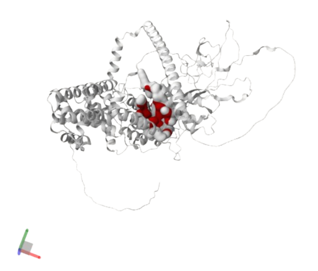

**Figura 1.** Cavidad principal predicha por P2Rank para **RAS guanyl-releasing protein 1**. La proteína se representa en color gris y la cavidad de unión identificada con mayor puntuación (**Pocket 1**) se muestra en rojo.

El análisis de composición realizado mediante el script desarrollado en **Python** mostró que:

* **35,3 %** de los residuos correspondían a residuos hidrofóbicos o aromáticos.
* **17,0 %** correspondían a residuos polares.
* La relación hidrofóbicos/polares fue aproximadamente **2:1**.

La **Pocket 1** fue seleccionada por presentar el mayor **Pocket Score**, un número adecuado de residuos y un predominio de residuos hidrofóbicos.

Sin embargo, al comparar la localización de la cavidad con la región estructural previamente alineada respecto de **SlCSP8**, se observó que **ningún residuo** pertenecía a la región alineada, obteniéndose una superposición del **0 %**.

En conjunto, estos resultados indicaron que, si bien la cavidad presentaba características compatibles con un posible sitio de unión, la ausencia de coincidencia con la región estructural conservada de **SlCSP8** limitó su relevancia.

Por este motivo, **RAS guanyl-releasing protein 1** no fue priorizada para las etapas posteriores del estudio.

---

### 4.2.2 Análisis de cavidades de Karyopherin-beta2 (5J3V)

La proteína **Karyopherin-beta2 (5J3V)** fue seleccionada para el análisis debido a que apareció entre los candidatos con mejor similitud estructural obtenidos mediante **Foldseek** en modo **TM-align**.

El análisis mediante **P2Rank** identificó como cavidad principal la **Pocket 1** (**Figura 2**), obteniéndose:

| Parámetro          | Valor |
| ------------------ | ----: |
| Rank               |     1 |
| Pocket Score       | 15.72 |
| Probability        | 0.756 |
| Número de residuos |    23 |

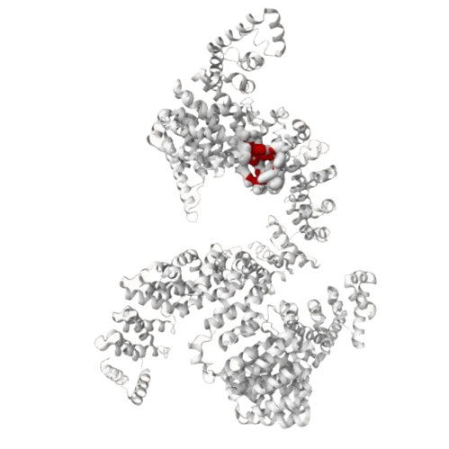
**Figura 2.** Cavidad principal predicha por P2Rank para **Karyopherin-beta2 (5J3V)**. La proteína se representa en gris y la **Pocket 1** en color rojo.

El análisis de composición mostró:

* **56,5 %** de residuos hidrofóbicos o aromáticos.
* **21,7 %** de residuos polares.
* Relación hidrofóbicos/polares ≈ **2,6 : 1**.

Estos resultados indicaron una cavidad con un marcado carácter hidrofóbico.

No obstante, al comparar la localización de la cavidad con la región estructural alineada respecto de **SlCSP8**, se observó una superposición del **0 %**.

En consecuencia, aunque presentó una cavidad con características fisicoquímicas favorables para la unión de compuestos hidrofóbicos, **Karyopherin-beta2** fue descartada como candidata, ya que el sitio de unión no coincidía con la región estructural conservada de la proteína de referencia.

---

### 4.2.3 Análisis de cavidades de GGA3 VHS domain (1JUQ)

El **GGA3 VHS domain (1JUQ)** fue seleccionado para el análisis debido a que apareció de forma recurrente en las búsquedas realizadas mediante **Foldseek** y **TM-align**.

El análisis mediante **P2Rank** identificó como cavidad principal la **Pocket 1** (**Figura 3**), obteniéndose:

| Parámetro          | Valor |
| ------------------ | ----: |
| Rank               |     1 |
| Pocket Score       | 15.38 |
| Probability        | 0.756 |
| Número de residuos |    24 |

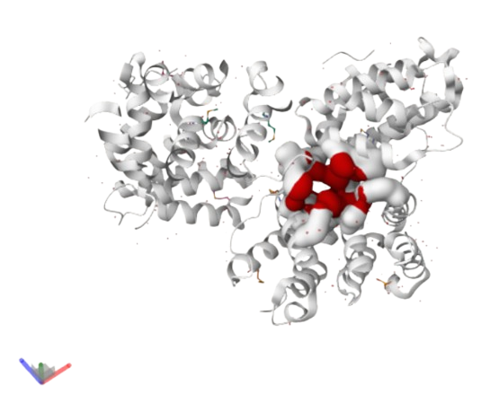
**Figura 3.** Cavidad principal predicha por P2Rank para **GGA3 VHS domain (1JUQ)**. La proteína se representa en color gris y la **Pocket 1** en rojo.

La **Pocket 1** presentó un centro geométrico ubicado en las coordenadas **(36.31, 16.05, 16.71) Å**, definiendo un bolsillo compacto y bien delimitado (**Figura 4**).

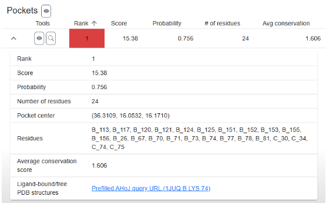

**Figura 4.** Resultados obtenidos mediante P2Rank para la **Pocket 1** de **GGA3 VHS domain**. Se muestran el **Pocket Score**, la **Probability**, el número de residuos asociados, las coordenadas del centro de la cavidad y los residuos que la conforman.

El análisis de composición mostró:

* **43,5 %** de residuos hidrofóbicos o aromáticos.
* **17,4 %** de residuos polares.
* Relación hidrofóbicos/polares ≈ **2,5 : 1**.

Además, al comparar la cavidad con la región estructural alineada respecto de **SlCSP8**, se observó que **19 de los 24 residuos** pertenecían a la región alineada, obteniéndose una superposición del **79,2 %**.

Este resultado indicó una elevada correspondencia entre el bolsillo de unión identificado y la región estructural conservada de la proteína de referencia.

---

### 4.2.4 Comparación de los candidatos

La comparación de las cavidades predichas mostró diferencias importantes entre las proteínas analizadas.

**RAS guanyl-releasing protein 1** y **Karyopherin-beta2** presentaron cavidades compatibles con la unión de ligandos hidrofóbicos; sin embargo, en ambos casos la superposición con la región estructural alineada de **SlCSP8** fue del **0 %**, lo que disminuyó considerablemente su relevancia como candidatos.

En contraste, **GGA3 VHS domain (1JUQ)** presentó:

* Un **Pocket Score** elevado.
* Una composición predominantemente hidrofóbica.
* Una relación hidrofóbicos/polares favorable.
* Una superposición del **79,2 %** con la región estructural alineada respecto de **SlCSP8**.

Estas características se resumen en la **Tabla 4**.

**Tabla 4. Comparación de las proteínas analizadas mediante P2Rank.**

| Proteína                       | Pocket Score | Probability | Residuos | % Hidrofóbicos | Superposición |    Decisión    |
| ------------------------------ | -----------: | ----------: | -------: | -------------: | ------------: | :------------: |
| RAS guanyl-releasing protein 1 |         5.18 |       0.251 |       17 |         35.3 % |           0 % |  ❌ Descartada  |
| Karyopherin-beta2 (5J3V)       |        15.72 |       0.756 |       23 |         56.5 % |           0 % |  ❌ Descartada  |
| **GGA3 VHS domain (1JUQ)**     |    **15.38** |   **0.756** |   **24** |     **43.5 %** |    **79.2 %** | ✅ Seleccionada |

En conjunto, estos resultados indicaron que **GGA3 VHS domain (1JUQ)** fue la proteína que mejor reprodujo las características estructurales del sitio de unión descrito para **SlCSP8**.

En consecuencia, **GGA3 VHS domain (1JUQ)** fue seleccionada para las etapas posteriores del estudio, incluyendo la validación de cavidades mediante **CB-Dock2** y los estudios de *docking* molecular.

### 4.4 Preparación de la biblioteca de ligandos

Se construyó una biblioteca de ligandos integrada por compuestos naturales con actividad insecticida o previamente reportados por su interacción con proteínas quimiosensoriales de insectos.

La biblioteca estuvo compuesta por **rhodojaponina III**, utilizada como ligando de referencia debido a su afinidad experimental por **SlCSP8**, además de **bombykol**, **12-bromododecanol**, **azadiractina**, **nicotina** y **limoneno**.

**Tabla 5. Ligandos incluidos en la biblioteca para los estudios de *docking*.**

| Ligando           | Función dentro del estudio                          |
| ----------------- | --------------------------------------------------- |
| Rhodojaponina III | Ligando de referencia positiva                      |
| Bombykol          | Ligando de comparación reportado para proteínas CSP |
| 12-Bromododecanol | Análogo utilizado en estudios de proteínas CSP      |
| Azadiractina      | Insecticida natural                                 |
| Nicotina          | Compuesto insecticida de origen natural             |
| Limoneno          | Monoterpeno con actividad insecticida               |

Durante la preparación de los ligandos, todas las estructuras fueron convertidas correctamente al formato **PDBQT**, incorporando hidrógenos explícitos, optimizando su geometría mediante el campo de fuerzas **MMFF94** y calculando las cargas parciales de **Gasteiger**.

Como control de calidad, se verificó el número de átomos y la carga total aproximada de cada archivo generado.

Los valores obtenidos fueron cercanos a cero en todos los casos analizados, indicando una preparación adecuada para su utilización en los estudios de *docking* molecular.

**Tabla 6. Validación de la preparación de los ligandos utilizados en los estudios de *docking* molecular.**

| Ligando           | Archivo                          | Átomos (PDBQT) | Carga total aproximada |
| ----------------- | -------------------------------- | -------------: | ---------------------: |
| Rhodojaponina III | Conformer3DRhodojaponina.sdf     |             58 |                  0.001 |
| Bombykol          | Conformer3DBombykol.sdf          |             47 |                  0.006 |
| 12-Bromododecanol | Conformer3D12-Bromododecanol.sdf |             39 |                  0.007 |
| Nicotina          | Conformer3D_Nicotina.sdf         |             26 |                  0.001 |
| Limoneno          | Conformer3D_Limoneno.sdf         |             26 |                 −0.004 |

---

### 4.5 Docking molecular

Como primera etapa del análisis de *docking* molecular, el servidor **CB-Dock2** identificó automáticamente cinco cavidades potenciales de unión en la estructura de **GGA3 VHS domain (PDB ID: 1JUQ)** (**Figura 5**).

Para cada cavidad, el servidor estimó el volumen, las coordenadas del centro y el tamaño de la caja de búsqueda utilizada para el *docking*.

**Tabla 7. Cavidades predichas por CB-Dock2 para GGA3 VHS domain (1JUQ).**

| Cavidad | Volumen (ų) | Centro (x, y, z) | Tamaño de la caja (x, y, z) |
| ------- | -----------: | ---------------- | --------------------------- |
| C1      |         2518 | (28, 20, 24)     | (30, 16, 28)                |
| **C2**  |     **1393** | **(35, 17, 18)** | **(15, 18, 20)**            |
| C3      |         1322 | (24, 18, 38)     | (14, 19, 17)                |
| C4      |          943 | (47, 25, 10)     | (11, 15, 15)                |
| C5      |          857 | (12, 35, 24)     | (16, 16, 11)                |

La comparación entre las cavidades predichas por **CB-Dock2** y el análisis previo realizado mediante **P2Rank** mostró que la **Cavity 2 (C2)** presentaba la mayor correspondencia espacial con la **Pocket 1** previamente identificada.

Además, las coordenadas del centro de ambas cavidades fueron muy similares, confirmando que ambas herramientas identificaban el mismo bolsillo de unión.

En consecuencia, la **Cavity 2** fue seleccionada como región de referencia para los estudios de *docking* molecular.

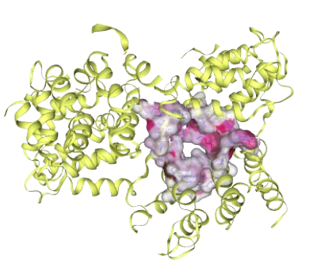

**Figura 5.** Visualización de la **Cavity 2** identificada mediante **CB-Dock2** en **GGA3 VHS domain (PDB ID: 1JUQ)**. La proteína se representa en amarillo y la cavidad seleccionada para los estudios de *docking* molecular se muestra como una superficie en color magenta.

Una vez seleccionada la cavidad **C2**, se realizaron los estudios de *docking* molecular para todos los ligandos de la biblioteca.

Si bien **CB-Dock2** identificó, en algunos casos, otras cavidades con valores de **Vina Score** ligeramente más favorables, se mantuvo la cavidad **C2** para todos los análisis con el fin de preservar un criterio uniforme de comparación.

Los resultados obtenidos se resumen en la **Tabla 8**.

**Tabla 8. Afinidad de unión estimada mediante CB-Dock2 para los ligandos evaluados en la cavidad C2 de GGA3 VHS domain (1JUQ).**

| Ligando               | Cavidad analizada | Vina Score (kcal/mol) |
| --------------------- | :---------------: | --------------------: |
| **Rhodojaponina III** |         C2        |              **−7.2** |
| Nicotina              |         C2        |                  −6.0 |
| Limoneno              |         C2        |                  −5.7 |
| 12-Bromododecanol     |         C2        |                  −5.4 |
| Bombykol              |         C2        |                  −5.3 |

Los estudios de *docking* molecular mostraron diferencias en la afinidad de unión de los ligandos evaluados hacia **GGA3 VHS domain (1JUQ)**.

La **rhodojaponina III** presentó el **Vina Score** más favorable (**−7.2 kcal/mol**), indicando la mayor afinidad de unión entre los compuestos analizados.

La **nicotina** mostró una afinidad intermedia (**−6.0 kcal/mol**), mientras que **limoneno**, **12-bromododecanol** y **bombykol** presentaron afinidades progresivamente menores.

En conjunto, estos resultados indican que **GGA3 VHS domain (1JUQ)** es capaz de establecer interacciones favorables con diversos ligandos originalmente asociados a proteínas quimiosensoriales de insectos, siendo la **rhodojaponina III** el compuesto con mayor afinidad predicha.

Estos resultados respaldan la selección de **GGA3 VHS domain (1JUQ)** como el candidato humano más promisorio dentro del *pipeline* propuesto, aunque las afinidades obtenidas constituyen predicciones computacionales que deberán ser validadas mediante estudios experimentales o simulaciones complementarias.

---

#### 4.5.1 Validación de los resultados mediante AutoDock Vina

Con el objetivo de evaluar la reproducibilidad de los resultados obtenidos mediante **CB-Dock2**, se realizaron dos corridas independientes de *docking* molecular utilizando **AutoDock Vina** para cada uno de los ligandos analizados.

Los resultados obtenidos se presentan en la **Tabla 9**.

**Tabla 9. Resultados del *docking* molecular realizado mediante AutoDock Vina sobre la cavidad C2 de GGA3 VHS domain (1JUQ).**

| Ligando           | Cavidad | Vina Score 1 | Vina Score 2 |   Promedio | Desviación estándar |
| ----------------- | :-----: | -----------: | -----------: | ---------: | ------------------: |
| Rhodojaponina III |    C2   |       −6.099 |       −6.105 | **−6.102** |               0.004 |
| Nicotina          |    C2   |       −5.304 |       −5.661 |     −5.483 |               0.252 |
| Limoneno          |    C2   |       −5.291 |       −5.344 |     −5.318 |               0.037 |
| Bombykol          |    C2   |       −5.256 |       −5.343 |     −5.300 |               0.062 |
| 12-Bromododecanol |    C2   |       −4.892 |       −4.706 |     −4.799 |               0.132 |

Los resultados obtenidos mediante **AutoDock Vina** mostraron una tendencia consistente con la observada previamente mediante **CB-Dock2**.

En ambos casos, la **rhodojaponina III** presentó la mayor afinidad promedio de unión (**−6.102 ± 0.004 kcal/mol**), seguida por:

1. Nicotina.
2. Limoneno.
3. Bombykol.
4. 12-Bromododecanol.

Las diferencias entre las dos corridas fueron reducidas para la mayoría de los ligandos, indicando una adecuada reproducibilidad del procedimiento de *docking*.

La comparación entre los resultados obtenidos mediante **CB-Dock2** y **AutoDock Vina** mostró que, aunque existieron pequeñas diferencias en los valores absolutos de afinidad, ambos métodos conservaron la misma tendencia general, identificando a la **rhodojaponina III** como el ligando con mayor afinidad predicha hacia **GGA3 VHS domain (1JUQ)**.

Para el análisis estructural posterior de las interacciones proteína–ligando se conservaron los archivos correspondientes a la corrida que presentó la mayor afinidad de unión para cada compuesto.

Estos archivos, generados por **AutoDock Vina** en formato **PDBQT**, fueron utilizados para la visualización de los complejos y el análisis de las interacciones moleculares.

### 4.6 Análisis de las interacciones proteína–ligando

Como primera aproximación, los complejos formados por **GGA3 VHS domain (PDB ID: 1JUQ)** con **rhodojaponina III** y **nicotina**, obtenidos mediante *docking* molecular, fueron inspeccionados visualmente utilizando **PyMOL** (**Figuras 6 y 9**).

Este análisis permitió identificar los residuos localizados en las proximidades de los ligandos dentro de la cavidad **C2**.

---

#### 4.6.1 Complejo GGA3 VHS domain – Rhodojaponina III

Para el complejo formado por **GGA3 VHS domain (1JUQ)** y **rhodojaponina III**, los residuos próximos al ligando fueron:

* Asp34
* Glu70
* Ala71
* Mse73
* Lys74
* Asn75
* Cys76
* Gly77
* Leu117
* Trp121
* Ala124
* Thr155
* Leu156

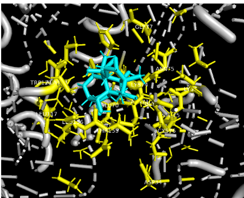

**Figura 6.** Análisis visual del sitio de unión del complejo **GGA3 VHS domain (1JUQ)–rhodojaponina III** realizado mediante **PyMOL**. El ligando se representa en color celeste y los residuos localizados a una distancia ≤ 4 Å en color amarillo.

Posteriormente, el análisis realizado mediante **Protein–Ligand Interaction Profiler (PLIP)** permitió identificar las interacciones moleculares específicas entre la proteína y el ligando.

Se detectaron:

* **5 contactos hidrofóbicos**, correspondientes a los residuos:

  * Lys74
  * Ala124
  * Leu125
  * Leu156

* **4 puentes de hidrógeno**, establecidos con:

  * Lys74
  * Gly77
  * Ala124
  * Thr155

Los puentes de hidrógeno establecidos con **Thr155** y **Lys74** presentaron las menores distancias donador–aceptor (**2.70 Å** y **2.80 Å**, respectivamente), lo que sugiere una contribución importante a la estabilización del complejo.

No se detectaron interacciones aromáticas de tipo **π–π**.

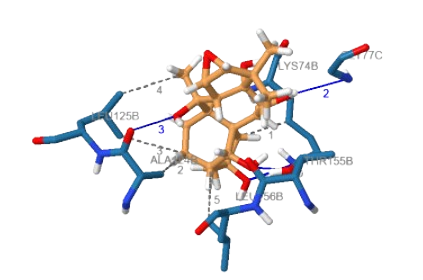

**Figura 7.** Diagrama bidimensional de las interacciones entre **rhodojaponina III** y **GGA3 VHS domain**, generado mediante **PLIP**.

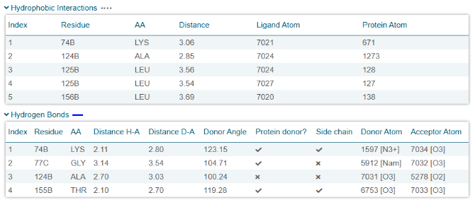

**Figura 8.** Resumen de las interacciones proteína–ligando identificadas mediante **PLIP** para el complejo **GGA3 VHS domain–rhodojaponina III**.

La comparación con los residuos funcionalmente relevantes descritos para **SlCSP8** mostró un entorno predominantemente hidrofóbico.

En particular, los residuos **Leu125** y **Leu156** podrían desempeñar un papel funcional comparable al atribuido a **Leu60** en **SlCSP8**.

En contraste, no se identificaron residuos aromáticos equivalentes a **Tyr25**, lo que sugiere diferencias en el mecanismo de reconocimiento molecular entre ambas proteínas.

---

#### 4.6.2 Complejo GGA3 VHS domain – Nicotina

Para el complejo formado entre **GGA3 VHS domain (1JUQ)** y **nicotina**, los residuos próximos al ligando fueron:

* Glu70
* Mse73
* Lys74
* Asn75
* Gly77
* Leu117
* Ser120
* Trp121
* Pro151
* Val152
* Asp153
* Arg154
* Thr155
* Leu156

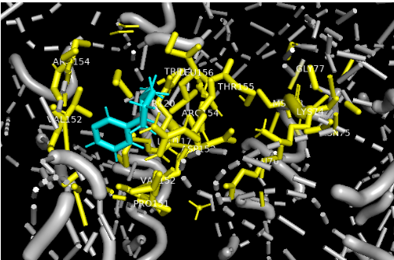

**Figura 9.** Análisis visual del sitio de unión del complejo **GGA3 VHS domain (1JUQ)–nicotina** realizado mediante **PyMOL**.

El análisis mediante **PLIP** permitió identificar las interacciones específicas entre la nicotina y la proteína.

Se detectaron:

* **3 contactos hidrofóbicos**, correspondientes a:

  * Val152
  * Arg154

* **1 puente de hidrógeno**, establecido con:

  * Asp153

El puente de hidrógeno presentó una distancia donador–aceptor de **3.31 Å**.

Al igual que para la rhodojaponina III, no se identificaron interacciones aromáticas de tipo **π–π**.

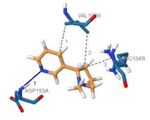

**Figura 10.** Diagrama bidimensional de las interacciones entre **nicotina** y **GGA3 VHS domain**, generado mediante **PLIP**.

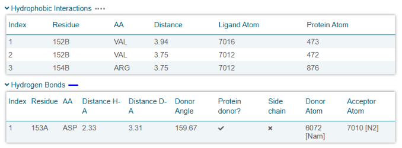

**Figura 11.** Resumen de las interacciones proteína–ligando identificadas mediante **PLIP** para el complejo **GGA3 VHS domain–nicotina**.

La comparación con los residuos funcionalmente relevantes descritos para **SlCSP8** mostró que tampoco se identificaron residuos aromáticos equivalentes a **Tyr25**.

En cuanto a los residuos hidrofóbicos, **Val152** participa en el reconocimiento del ligando y podría desempeñar un papel funcional comparable al atribuido a **Leu60**, aunque involucrando un conjunto de residuos diferente al observado para la **rhodojaponina III**.

---

**Tabla 10. Resumen de las interacciones proteína–ligando identificadas mediante PLIP.**

| Ligando               | Puentes de hidrógeno | Contactos hidrofóbicos | Interacciones π–π |
| --------------------- | :------------------: | :--------------------: | :---------------: |
| **Rhodojaponina III** |         **4**        |          **5**         |         No        |
| **Nicotina**          |         **1**        |          **3**         |         No        |

En conjunto, el análisis de las interacciones proteína–ligando mostró que tanto la **rhodojaponina III** como la **nicotina** fueron capaces de establecer interacciones específicas con residuos de la cavidad **C2** de **GGA3 VHS domain (1JUQ)**.

Sin embargo, la **rhodojaponina III** presentó una red de interacciones más extensa, caracterizada por un mayor número de puentes de hidrógeno y contactos hidrofóbicos.

Se destacó particularmente la participación de los residuos **Leu125** y **Leu156**, funcionalmente comparables a **Leu60** descrito en **SlCSP8**.

En contraste, la **nicotina** interactuó principalmente con **Val152** y **Arg154**, sin involucrar residuos leucina en sus contactos hidrofóbicos.

Asimismo, ninguno de los complejos presentó interacciones aromáticas de tipo **π–π** equivalentes a las asociadas con **Tyr25**.

En conjunto, estos resultados sugieren que la mayor participación de residuos hidrofóbicos de tipo leucina podría contribuir a una mayor estabilización del complejo formado por la **rhodojaponina III**, en concordancia con la mayor afinidad de unión predicha para este ligando.

# 5. Discusión

La identificación de proteínas humanas estructuralmente similares a **SlCSP8** representó el primer desafío del presente trabajo.

Si bien las herramientas de alineamiento estructural, como **Foldseek**, **TM-align** y **DALI**, permitieron identificar proteínas con distintos grados de similitud respecto de la proteína de referencia, los resultados obtenidos evidenciaron que la semejanza estructural global no constituye, por sí sola, un criterio suficiente para seleccionar candidatos para estudios de interacción proteína–ligando.

En este contexto, la incorporación del análisis de cavidades mediante **P2Rank** resultó fundamental para la selección de la proteína candidata.

Mientras que algunos candidatos presentaban alineamientos estructurales favorables, sus cavidades no coincidían con la región alineada respecto de **SlCSP8** o no presentaban una composición fisicoquímica compatible con la unión de compuestos hidrofóbicos.

Por el contrario, **GGA3 VHS domain (PDB ID: 1JUQ)** fue el único candidato que combinó:

* Una elevada correspondencia entre la cavidad predicha y la región estructural conservada.
* Un entorno predominantemente hidrofóbico.

Estas características justificaron su selección para los estudios posteriores.

La concordancia observada entre los resultados obtenidos mediante **P2Rank** y **CB-Dock2** reforzó esta selección.

Ambas herramientas identificaron prácticamente la misma región como principal sitio de unión, aportando mayor confianza en la elección de la cavidad utilizada para los estudios de *docking* molecular.

Estos resultados muestran que la integración de diferentes metodologías permitió reducir la incertidumbre asociada al uso de una única herramienta de predicción.

Los estudios de *docking* molecular mostraron que todos los ligandos evaluados fueron capaces de unirse a la cavidad seleccionada, aunque con diferentes afinidades.

La **rhodojaponina III** presentó la mayor afinidad de unión, resultado esperable considerando que constituye el ligando de referencia de **SlCSP8** y que las características de la cavidad fueron seleccionadas buscando reproducir las propiedades del sitio de unión de dicha proteína.

Por otra parte, la **nicotina** también presentó una afinidad favorable, lo que sugiere que otros compuestos insecticidas naturales podrían interactuar con proteínas humanas que compartan características estructurales similares.

El análisis de las interacciones proteína–ligando permitió explicar parcialmente las diferencias observadas en las afinidades predichas.

La **rhodojaponina III** estableció una red de interacciones más extensa que la nicotina, presentando un mayor número de puentes de hidrógeno y contactos hidrofóbicos.

Además, la participación de los residuos **Leu125** y **Leu156**, funcionalmente comparables con **Leu60** descrito para **SlCSP8**, sugiere que estos podrían desempeñar un papel importante en la estabilización del complejo proteína–ligando.

En contraste, la nicotina estableció un número menor de interacciones específicas y no involucró residuos equivalentes a **Leu60**.

Asimismo, en ninguno de los complejos se identificaron interacciones aromáticas de tipo **π–π**, indicando que el reconocimiento molecular en **GGA3 VHS domain** podría depender principalmente de contactos hidrofóbicos y puentes de hidrógeno.

En conjunto, los resultados obtenidos ponen de manifiesto que la integración de herramientas de búsqueda por similitud estructural, predicción de cavidades, *docking* molecular y análisis de interacciones constituye una estrategia útil para identificar posibles proteínas humanas con capacidad de reconocer compuestos insecticidas naturales.

Si bien las predicciones realizadas deberán validarse experimentalmente, el *pipeline* desarrollado proporciona una metodología reproducible que podrá aplicarse en futuros estudios orientados a la exploración de nuevas interacciones proteína–ligando y a la evaluación preliminar de posibles efectos fuera del organismo blanco.

---

# 6. Limitaciones del estudio

El presente trabajo presenta diversas limitaciones computacionales.

En primer lugar, la búsqueda de proteínas estructuralmente similares depende de la información disponible en las bases de datos consultadas. Por lo tanto, proteínas humanas aún no caracterizadas experimentalmente o ausentes de dichas bases no pudieron ser consideradas durante el proceso de selección.

Asimismo, **Foldseek** constituye una herramienta eficiente para el cribado inicial de candidatos estructurales; sin embargo, no proporciona directamente parámetros como el **Z-score** o el **RMSD**, por lo que fue necesario complementar el análisis mediante **DALI**.

Otra limitación corresponde al análisis de *docking* molecular, realizado utilizando estructuras proteicas estáticas y funciones de puntuación simplificadas.

En consecuencia, las energías de unión obtenidas representan estimaciones teóricas que no contemplan completamente:

* La flexibilidad conformacional de proteínas y ligandos.
* Los efectos del solvente.
* Los cambios estructurales inducidos por la unión del ligando.

Además, el análisis se realizó utilizando una única conformación cristalográfica de **GGA3 VHS domain (PDB ID: 1JUQ)**, por lo que no puede descartarse que otras conformaciones presenten diferencias en la geometría del sitio de unión capaces de modificar las afinidades predichas.

La estructura cristalográfica utilizada contiene un residuo de **selenometionina (MSE73)** incorporado durante su resolución experimental.

Aunque este residuo fue conservado durante todos los análisis y no participó en interacciones específicas según **PLIP**, constituye una diferencia respecto de la secuencia nativa de la proteína y representa una limitación inherente al modelo estructural empleado.

Por otra parte, la biblioteca estuvo compuesta por un número reducido de ligandos seleccionados en función de su relevancia bibliográfica y de su relación con proteínas quimiosensoriales de insectos.

En consecuencia, los resultados obtenidos no pueden extrapolarse directamente al comportamiento de otros insecticidas naturales ni a compuestos con propiedades fisicoquímicas diferentes.

Finalmente, el proceso de selección del candidato estructural se basó en la integración de múltiples criterios bioinformáticos, incluyendo:

* Similitud estructural.
* Predicción de cavidades.
* Composición fisicoquímica.
* Estudios de *docking* molecular.

Si bien este enfoque permitió desarrollar un *pipeline* reproducible, los criterios utilizados podrían optimizarse en futuros trabajos mediante la incorporación de nuevas proteínas de referencia, conjuntos de datos experimentales o metodologías computacionales adicionales.

En conjunto, los resultados obtenidos constituyen **predicciones computacionales** que deberán ser corroboradas mediante estudios experimentales, tales como:

* Ensayos de afinidad.
* Cristalografía de rayos X.
* Resonancia magnética nuclear.
* Simulaciones de dinámica molecular.

No obstante, el *pipeline* desarrollado proporciona una estrategia sistemática para la identificación preliminar de posibles interacciones entre proteínas humanas y compuestos insecticidas naturales.

---

# 7. Conclusiones

En el presente trabajo se desarrolló un **pipeline de bioinformática estructural** para identificar proteínas humanas con potencial capacidad de interacción con compuestos insecticidas naturales previamente descritos para la proteína quimiosensorial **SlCSP8** de *Spodoptera litura*.

La integración de herramientas de:

* Alineamiento estructural.
* Predicción de cavidades.
* *Docking* molecular.
* Análisis de interacciones proteína–ligando.

permitió evaluar de manera sistemática los candidatos obtenidos durante el proceso de búsqueda.

Como resultado, **GGA3 VHS domain (PDB ID: 1JUQ)** fue identificado como el candidato más adecuado para los estudios de interacción, al presentar una cavidad con características estructurales y fisicoquímicas compatibles con el sitio de unión de la proteína de referencia.

Los estudios de *docking* molecular mostraron que la **rhodojaponina III** presentó la mayor afinidad de unión, seguida por la **nicotina**.

Asimismo, el análisis de las interacciones proteína–ligando evidenció una red de contactos más extensa para la rhodojaponina III, consistente con su mayor afinidad predicha.

En conjunto, los resultados demuestran que la incorporación del análisis de cavidades y del estudio detallado de las interacciones proteína–ligando aporta información complementaria a la obtenida mediante las herramientas de alineamiento estructural, permitiendo una selección más robusta de proteínas candidatas para estudios de *docking* molecular.

Finalmente, los resultados obtenidos sugieren que proteínas humanas con cavidades estructuralmente compatibles podrían interactuar con moléculas originalmente descritas como ligandos de proteínas quimiosensoriales de insectos.

Si bien estas interacciones requieren validación experimental, el *pipeline* desarrollado constituye una herramienta útil para generar hipótesis sobre posibles interacciones entre proteínas humanas y compuestos bioactivos de origen natural.

---

# Bibliografía

1. Jia Q, Zeng H, Zhang J, Gao S, Xiao N, Tang J, Dong X, Xie W. **The Crystal Structure of the *Spodoptera litura* Chemosensory Protein CSP8.** *Insects*. 2021;12(7):602. doi:10.3390/insects12070602.

2. Vontas J, Mavridis K. **Vector population monitoring tools for insecticide resistance management: Myth or fact?** *Pesticide Biochemistry and Physiology*. 2019;161:54–60. doi:10.1016/j.pestbp.2019.08.005.
